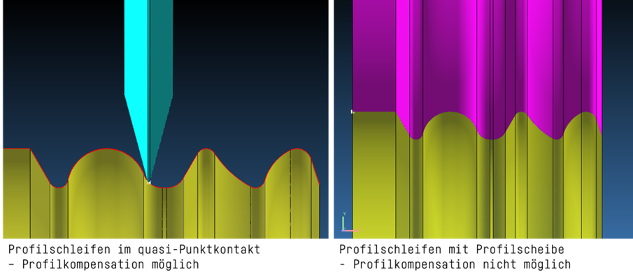

# PComp

*Closed Loop-compensation in Profile Grinding*

Dieses Repository beschriebt das Vorgehen und das Austauschformat bei der Profilkompensation (Closed Loop).
Das Json-Format wird über ein Json-Schema dokumentiert und auf validität getestet. 

## 1.1 Definition Profilkompensation und Closed Loop

Die **Profilkompensation** korrigiert geschliffene Formelemente (Walzwerkzeuge, Stechplattenprofile, Formfräserprofile, …) oder erzeugte Geometrieelemente (Nutsteigungsverläufe, …). In der Regel wird der Schlichtpfad kompensiert, welcher zuvor mit Punktkontakt zwischen Schleifscheibe und Werkstück geschliffen wurden.
Die Profilkompensation beim Einstechschleifen mit Profilscheiben ist geometrisch nicht möglich. Der vorliegende Linenkontakt verhindert das. Alternativ kann hier der Abrichtprozess kompensiert werden, sofern dieser mit Punktkontakt stattfindet.

Die Profilerfassung zur Kompensation erfolgt typischerweise auf einer Messmaschine, wäre aber prinzipiell auch auf der Schleifmaschine möglich. Der Begriff **Closed Loop** in der Systemtechnik bedeutet, dass in diesem Fall die Messung in einem geschlossenen Kreislauf zur Kompensation zurückgeführt wird.
Adelbert Haas verwendet den Begriff Closed Loop ausschließlich im Falle der Profilkompensation und nicht für die Kompensation einzelner Werkstückparameter (Durchmesser, Steigung, Winkel, etc.). Im systemtechnischen Sinn ist dies auch als Closed Loop Kompensation zu sehen und wird von anderen Maschinenhersteller auch in diesem Sinne verwendet.     

## 1.2 Potentiale und Voraussetzungen

<Haas Intern>

## 2. Technische Realisierung der Profilkompensation

Der ClosedLoop zur Profilkompensation wird über einen File-basierten Austausch ermöglicht. Schleifmaschine (Schleifsoftware) und Messmaschine (Messsoftware) schreiben für eine Kompensation ein *.Json-File welches nachfolgend erläutert wird.
Auf einen Austauschordner auf Kundenserver, Schleif oder Messmaschine  greifen beide Software zu. Die Schleifsoftware schreibt die Nominalwerte und liest *sofern vorhanden* Actualwerte ein. Die Messmaschine liest die Nominalwerte und misst entsprechend. Für jede erfolgreiche Messung werden die Actualwerte in das Json-File geschrieben.

### 2.1 *.json-File

* Schleifsoftware Horizon schreibt Nominal/Solldaten zur Messung für nachfolgende Kompensation
* Messmaschine hängt bei Bedarf (Automation/Bediener fordert an) Actual/Messresultat an Sollfile an.
* Einheitliche Beschreibung des kompensierten Werkstücks im gleichen File. 
* **json** ist das Format der Wahl, weil Metadaten und Daten durch Anwender und Maschine lesbar sind.
* Das File kann initial durch die Schleifsoftware geschrieben werden. Alternativ wird es eingelesen (nur Einfachkompensation).
* Format muss erweiterbar (versioniert) sein.
* FileName entspricht dem Produktname > Leerzeichen und Umlaute sind möglich!

### 2.2 Messung

* Nominaldaten werden über Punkte und zugehörige Normalenvektoren in Werkstückkoordinaten definiert. 
  * i.d.R. über X/Y-Koordinate
  * üblicherweise wird dabei ein euklidischer Abstand von 0.02 mm vorgewählt.
  * wiederholte (doppelte) Eineindeutige Punkte  können vorkommen. (Info: Wird mit zukünftiger Version der Schleifsoftware voraussichtlich entfallen)
* Messwerte werden an jedem Punkt als Abweichung (Soll-Ist) in Normalenrichtung zurückgegeben.
  * i.d.R. muss dabei eine Einpassung stattfinden. 

### 2.3 Optionen

* Falls ein File im Ordner existiert, und die Sollpunkte von den Istpunkten abweichen (z.B. weil Scheibendaten geändert/ Kontur geändert) gibt die Schleifsoftware einen Fehler mit Option das File neu zu schreiben. Vorhandene Korrekturen werden dann überschrieben. Die Nominaldaten müssen vor jeder Messung geschrieben werden.
* <Intern>: wenn kein Nominal vorhanden, kann die Messmaschine auch Nominal über ein eingeladenes Messfile (externes DXF) interpolieren. Dann ist aber nur eine Korrektur möglich. alternativ kann hier das "einfache" 6/7-Spalten Format verwendet werden.
* Wenn 2d Konturen gehandhabt werden, sollte das Profil diese Werte auswerten können. 3D geht auch, ich muss aber die Info immer mitziehen.

### 2.4 Designfragen: 

* Um Probleme mit Datenkonvertierung zu vermeiden ist eine Vergleichstoleranz von 7 Nachkommastellen sinnvoll. Gerechnet wird aber auf den Normalen.
* Auf Werte `Infinity` / `NaN` wird verzichtet, obwohl es sinnvoll wäre. [rfc4627](https://www.rfc-editor.org/rfc/rfc4627.txt)
* `id` der Punkte wird mit angegeben, für Menschliche Lesbarkeit und Fehlersuche
* zusammengehörige Daten werden immer gewährleistet. Deshalb wurde das Konzept "wenn werte sich nicht ändern, müssen Listenelemente nicht geschrieben werden" verworfen (*Referenz*: Json aus SinucomNC-Trace). 
* Größe der Dateien ist kein großes Problem, mein Python-Skript (interpreter-Sprache) liest die Datei in 0.04s, schreiben dauert 0.04 -> Die Libs sind darauf optimiert. Auch Tests mit Schleifsoftware und 400 Profilmessung zeigt keine Probleme. 

### 2.5 Elemente: Objects/Arrays/Numbers/Strings

* siehe on descriptions json-Schema.

## 3. Altes Austauschformat

<Haas Intern>
